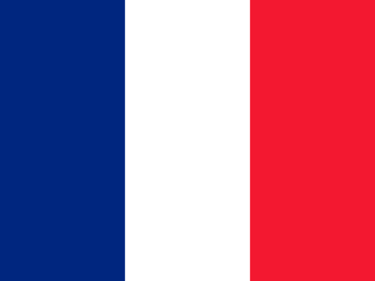

# CREDITS
Thank to all the people on this list <3
## Code:
- [Wavy-34](https://github.com/Wavy-34), wavy34_ on discord
- [Fenosoa](https://github.com/hugo-andriamaromanana), fenosoa on discord

## Assets:

### Svgs:
__Icons__:
-  <a href="https://iconscout.com/icons/setting" class="text-underline font-size-sm" target="_blank">Setting</a> by <a href="https://iconscout.com/contributors/chamedesign" class="text-underline font-size-sm">Chamestudio</a>
-  <a href="https://iconscout.com/icons/user" class="text-underline font-size-sm" target="_blank">User</a> by <a href="https://iconscout.com/contributors/chamedesign" class="text-underline font-size-sm" target="_blank">Chamestudio</a>
-  <a href="https://iconscout.com/icons/bluetooth" class="text-underline font-size-sm" target="_blank">Bluetooth</a> by <a href="https://iconscout.com/contributors/chamedesign" class="text-underline font-size-sm" target="_blank">Chamestudio</a>
-  <a href="https://iconscout.com/icons/round" class="text-underline font-size-sm" target="_blank">Round</a> on <a href="https://iconscout.com" class="text-underline font-size-sm">IconScout</a>
-  <a href="https://iconscout.com/icons/mail" class="text-underline font-size-sm" target="_blank">Mail</a> on <a href="https://iconscout.com" class="text-underline font-size-sm">IconScout</a>
-  <a href="https://iconscout.com/icons/right" class="text-underline font-size-sm" target="_blank">Right</a> on <a href="https://iconscout.com" class="text-underline font-size-sm">IconScout</a>
-  <a href="https://iconscout.com/icons/two" class="text-underline font-size-sm" target="_blank">Two</a> on <a href="https://iconscout.com" class="text-underline font-size-sm">IconScout</a>
-  <a href="https://iconscout.com/icons/false" class="text-underline font-size-sm" target="_blank">False</a> on <a href="https://iconscout.com" class="text-underline font-size-sm">IconScout</a>
-  <a href="https://iconscout.com/icons/heart" class="text-underline font-size-sm" target="_blank">Heart</a> on <a href="https://iconscout.com" class="text-underline font-size-sm">IconScout</a>

-  <a href="https://iconscout.com/icons/france" class="text-underline font-size-sm" target="_blank">France</a> on <a href="https://iconscout.com" class="text-underline font-size-sm">IconScout</a>
-  <a href="https://iconscout.com/icons/united" class="text-underline font-size-sm" target="_blank">United</a> on <a href="https://iconscout.com" class="text-underline font-size-sm">IconScout</a>

__Fonts__:

- <a href="https://www.dafont.com/arco.font">Arco</a> by <a href="https://www.dafont.com/rafael-olivo.d7756">Rafael Olivio</a>
- <a href="https://www.dafont.com/huglove.font">Huglove</a> by <a href="https://www.dafont.com/khurasan.d5849">Khurasan</a>
